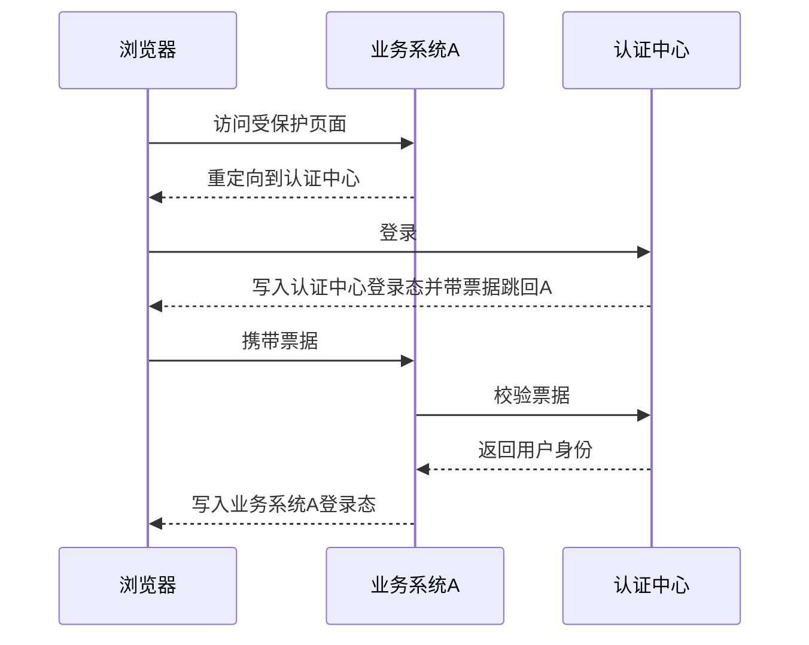

# 单点登录 SSO 是怎么工作的？

> SSO 的目标是让多个业务系统信任同一个认证中心：用户只登录一次，后续访问其他系统时通过票据换取本系统登录态。

## SSO 先解决什么问题？

假设公司里有这些系统：

- OA：请假、审批、公告；
- CRM：客户和商机；
- 报表平台：经营数据和导出；
- 权限中心：角色、菜单、数据范围。

如果每个系统都自己保存账号和密码，就会出现几个问题：

1. 用户要记多套密码，离职、改密、冻结账号要逐个系统处理；
2. 新系统接入时要重复开发登录、验证码、MFA、密码策略和风控；
3. 审计很难统一，查不清一个账号什么时候从哪里登录过哪些系统；
4. 某个系统安全做得弱，可能拖垮整个账号体系。

SSO 的思路是把“认证”收口到统一认证中心：业务系统不再直接校验密码，而是把未登录用户引导到认证中心。认证中心确认用户身份后，给业务系统一个可校验的短期凭证；业务系统再基于这个凭证建立自己的本地登录态。

注意这里有两个登录态：

| 登录态             | 保存在哪里             | 解决什么                                 |
| ------------------ | ---------------------- | ---------------------------------------- |
| 认证中心登录态     | 认证中心自己的域名下   | 证明用户已经在统一认证中心登录过         |
| 业务系统本地登录态 | 业务系统自己的域名下   | 让业务系统后续请求不必每次回认证中心校验 |
| 短期票据/授权码    | 回调链路中短暂出现一次 | 让业务系统用后端请求换取可信身份         |

所以 SSO 不是“所有系统共享同一个 Session”，也不是“前端拿到用户信息就算登录”。它的核心是：**业务系统信任认证中心的校验结果，但最终仍要建立和维护自己的登录态与权限上下文**。

## 核心角色有哪些？

```text
浏览器
  ├── 业务系统 A
  ├── 业务系统 B
  └── 统一认证中心
```

再展开一点，完整链路里通常有这些角色：

| 角色                        | 作用                                               |
| --------------------------- | -------------------------------------------------- |
| 浏览器/客户端               | 跟随重定向，保存 Cookie 或 Token                   |
| 业务系统                    | 发起登录跳转，接收回调，建立本系统登录态           |
| 认证中心/身份提供方         | 校验密码、MFA、设备、风控，维护中心登录态          |
| 票据/授权码                 | 一次性短期凭证，用来把“已认证”结果安全传回业务系统 |
| 用户目录                    | 保存用户、组织、账号状态、绑定关系                 |
| 权限系统                    | 登录后继续判断用户在当前系统、租户、资源上能做什么 |
| 回调地址和客户端注册信息    | 限定某个业务系统能从哪些地址接收登录结果           |
| Session/Token/Refresh Token | 登录成功后的本地会话、短期访问凭证和长期续期控制面 |

面试里要把这几个词区分开：认证中心负责“你是谁”，业务系统负责“接入后你在我这里能做什么”，票据只是中间桥梁，不应该长期当登录态用。

## 登录主流程

以业务系统 A 为例，典型流程是这样的：



关键点在第 6-8 步：业务系统不能直接信任浏览器带回来的用户信息，必须由后端拿票据去认证中心校验。

可以把它理解成两段：

1. **浏览器通道**：负责跳转和携带一次性票据，容易被用户、插件、代理、日志、Referer 暴露；
2. **后端通道**：业务系统服务端直接请求认证中心，用票据换身份结果，更可信、更容易做鉴权和审计。

如果用户再访问业务系统 B，会出现两种情况：

- 认证中心 Cookie 还在：B 重定向到认证中心后，认证中心发现用户已登录，直接签发给 B 的票据；
- 认证中心 Cookie 已过期或风险升高：认证中心要求重新输入密码、验证码或 MFA。

业务系统发起登录跳转时，不是简单“跳到登录页”。请求里通常会带 `client_id`、`redirect_uri`、`scope`、`response_type`、`state`、`nonce` 和原始访问地址等参数。认证中心要根据注册信息校验这些参数，再决定能不能登录、能签发什么范围的票据。

这就是“只登录一次”的来源：不是 B 神奇地读到了 A 的 Session，而是 A、B 都信任同一个认证中心。

## 能不能只靠共享 Cookie？

同一个主域名下的系统，确实可以把 Cookie Domain 设成父域，让多个子域都带上同一个 Cookie。

例如：

```text
Set-Cookie: SSO_TOKEN=...; Domain=.example.com; Secure; HttpOnly; SameSite=Lax
```

访问 `oa.example.com`、`crm.example.com`、`report.example.com` 时，浏览器都可能携带这个 Cookie。

父域 Cookie 只适合同一可注册主域下的子域，不能跨 `example.com` 和 `another.com`。而且第三方 Cookie 受浏览器策略影响越来越大，依赖隐藏 iframe 静默同步登录态或登出状态并不稳定。

但它只能解决一部分问题：

| 方案                   | 适合场景                         | 主要问题                                          |
| ---------------------- | -------------------------------- | ------------------------------------------------- |
| 父域共享 Cookie        | 同一主域名下的少量系统           | 跨主域名不适用，Cookie 泄露影响面大，权限边界不清 |
| 认证中心 + 一次性票据  | 多系统、多语言、跨域、统一认证   | 接入复杂度更高，需要注册回调和校验票据            |
| OAuth2 授权码/OIDC模式 | 第三方登录、开放平台、标准化接入 | 需要正确理解授权码、Token、ID Token 的边界        |
| CAS 类票据模式         | 企业内网、统一账号中心           | 标准生态和移动端适配要看具体实现                  |

共享 Cookie 最容易被误用成“所有系统共用一个超级登录态”。一旦任何子系统出现 XSS、日志泄露或配置错误，整个登录态都可能受影响。更稳的做法是让每个业务系统拿短期票据换自己的本地 Session，并在本地做权限、租户和风险控制。

## CAS、OAuth2、OIDC 和 SSO 是什么关系？

SSO 是目标：一次认证，多系统信任。

CAS、OAuth2、OIDC 更像不同的实现方式或协议组合：

| 名称            | 核心解决什么                             | 和 SSO 的关系                                            |
| --------------- | ---------------------------------------- | -------------------------------------------------------- |
| CAS 类票据模式  | 业务系统拿一次性服务票据向认证中心换身份 | 常用于企业内统一登录，流程很像“重定向 + 票据校验”        |
| OAuth2 授权码流 | 第三方客户端被授权访问资源               | 可以参与登录链路，但 OAuth2 本身主要是授权，不是身份协议 |
| OpenID Connect  | 在 OAuth2 之上标准化表达用户身份         | 常用于标准化单点登录，会返回可验证的身份声明             |
| SAML            | 企业身份联合和跨组织身份断言             | 常见于企业软件、办公套件、跨组织 SSO                     |

容易混淆的是 OAuth2。

OAuth2 的原始问题是“某个客户端能不能代表用户访问资源”，所以它发的是访问令牌。很多第三方登录会在 OAuth2 之上读取用户信息，再在本系统建立账号和登录态。真正标准化“这个用户是谁”的能力，通常要看 OpenID Connect 的 ID Token、`sub`、`iss`、`aud`、`nonce` 等身份语义。

CAS 语境里也可以这样理解：认证中心维护中心登录态，常见说法里会对应 TGT；业务系统拿到的是面向某个服务的一次性 ST。ST 校验成功后，业务系统再建立自己的本地会话。

面试里可以这样说：

> SSO 是系统目标，OAuth2/OIDC/CAS/SAML 是实现路径。OAuth2 偏授权，OIDC 在 OAuth2 上补身份层；不管哪种协议，业务系统都不应该直接信任前端传回的用户资料，而应该用后端通道校验票据或 Token。

## 票据和回调怎么防攻击？

票据是 SSO 链路里最敏感的中转凭证。它通常不长期保存，但一旦可重复使用，攻击者截获后就可能冒充用户登录业务系统。

一条相对安全的回调请求会带上这些信息：

```http
GET /callback?code=abc123&state=xyz
Host: app.example.com
```

后端再用 `code` 去认证中心换身份结果：

```text
code + client_id + client_secret 或 PKCE verifier + redirect_uri
  ↓
认证中心校验
  ↓
返回用户身份、令牌或身份声明
```

安全要点可以按这张表记：

| 控制点              | 为什么需要                                               |
| ------------------- | -------------------------------------------------------- |
| 短期有效            | 减少票据在日志、浏览器历史、代理里暴露后的可用窗口       |
| 一次性使用          | 防止截获后重放                                           |
| 绑定 `client_id`    | 防止 A 系统的票据被拿去 B 系统使用                       |
| 绑定 `redirect_uri` | 防止开放重定向，把票据带到攻击者域名                     |
| 校验 `state`        | 防止登录 CSRF，让回调和发起登录的请求对应起来            |
| 校验 `nonce`        | OIDC 场景下防止 ID Token 重放或串换                      |
| 使用 PKCE           | 公共客户端或移动端没有固定密钥时，减少授权码被截获的风险 |
| 全程 HTTPS          | 防止中间人窃听票据、Cookie 和 Token                      |
| 后端换票            | 避免前端直接拿票据拼身份，降低篡改和泄露风险             |

`state` 要形成闭环：业务系统发起登录前生成随机 `state`，保存在服务端 Session 或受保护 Cookie 中；回调时必须和保存值一致，校验后立即删除。不是“回调里带了 state 就安全”，而是要证明它和发起登录时保存的值匹配。

还有几个容易忽略的细节：

- `redirect_uri` 必须精确白名单，不要只判断域名前缀；
- 回调日志不要完整记录 `code`、`token`、`id_token`；
- 票据校验失败要立即拒绝，不要因为认证中心超时就默认放行；
- 回调成功后尽快清理 URL 里的敏感参数，避免被复制、收藏或 Referer 带走；
- 如果业务系统支持多租户，回调结果必须绑定租户和客户端，不能只看邮箱或手机号。

## 业务系统换到身份后还要做什么？

SSO 只完成统一认证，不等于完成本系统授权。

业务系统拿到认证中心返回的身份后，通常还要做这些事：

1. **账号映射**：外部身份 `sub`、手机号、邮箱、工号，要映射到本系统 userId；
2. **账号状态校验**：本系统账号是否启用、是否离职、是否被冻结；
3. **租户和组织校验**：用户是否属于当前租户、组织、项目或门店；
4. **本地登录态建立**：写入本系统 Session 或短期访问 Token；
5. **权限快照加载**：从 RBAC/权限中心加载角色、权限点、数据范围和版本号；
6. **审计记录**：记录登录来源、客户端、IP、设备、认证方式和结果；
7. **风险判断**：异地、异常设备、高危操作可以要求二次认证。

一个简化后的后端流程可以这样看：

```text
回调 code
  ↓
后端向认证中心换身份
  ↓
校验 issuer / audience / redirect_uri / nonce
  ↓
映射本地账号 + 校验账号状态和租户边界
  ↓
加载权限版本和数据范围
  ↓
写本地 Session / Access Token
  ↓
返回业务系统首页
```

如果使用 OIDC，不能只解码 ID Token 就当用户可信。业务系统要校验签名、`iss`、`aud`、`exp`、`iat`、`nonce`，必要时还要校验 `azp`，并从可信密钥集合获取签名 key。

不要把邮箱、手机号当成永久稳定主键。用户可能换邮箱，手机号可能换绑，不同租户也可能存在同名账号。更稳的是使用认证中心提供的稳定主体标识，再加上租户、客户端或系统范围做映射。

## 单点登出为什么更难？

登录只要让业务系统建立自己的登录态；登出则要让多个业务系统都清理登录态。

常见方式：

- 前端重定向通知多个系统登出。
- 后端由认证中心通知业务系统清理 Session。
- 业务系统每次请求都检查中心态或令牌版本。

实际工程里，单点登出经常做不到绝对实时，需要结合过期时间、刷新机制和风险等级设计。

可以把登出拆成三层：

| 层次           | 要清什么                          | 难点                                          |
| -------------- | --------------------------------- | --------------------------------------------- |
| 当前业务系统   | 本地 Session、Cookie、前端状态    | 只清当前系统，不代表其他系统退出              |
| 认证中心       | 中心登录态、Refresh Token、设备态 | 清中心态后，已登录业务系统的本地 Session 还在 |
| 其他已接入系统 | 各系统自己的 Session/Token        | 浏览器不一定打开，通知可能失败，系统可能离线  |

常见方案各有边界：

| 方案                 | 做法                                   | 边界                                           |
| -------------------- | -------------------------------------- | ---------------------------------------------- |
| 前端通知登出         | 认证中心让浏览器依次访问各系统登出地址 | 受浏览器、第三方 Cookie、网络和页面状态影响    |
| 后端通知登出         | 认证中心调用各业务系统后端登出接口     | 要维护接入系统清单、重试、签名和幂等           |
| 短期 Access Token    | 让访问凭证很快自然过期                 | 不是立即失效，只是缩短窗口                     |
| Refresh Token 吊销   | 禁止继续续期                           | 已发出的短期 Access Token 仍要等过期或查版本号 |
| Session/Token 版本号 | 请求时检查用户或设备的会话版本         | 引入服务端状态或缓存查询                       |
| 高危操作二次认证     | 删除、导出、授权前重新校验             | 只能保护高风险动作，不等于所有请求实时退出     |

按协议形态看，前端通知登出更像前通道登出：依赖浏览器跳转，体验直观但可靠性差。后端通知登出更像后通道登出：由认证中心调用业务系统后端，可靠性更好，但必须做好签名、重试、幂等和接入系统清单。

所以“单点登出”不要承诺绝对实时。更合理的表达是：普通业务用短过期和刷新令牌吊销控制窗口，高风险业务用中心态检查、版本号、二次认证和后端通知缩短失效时间。

## 多端、多租户和跨域要注意什么？

SSO 一旦进入工程落地，复杂度通常来自边界条件。

### 多端登录

Web、App、小程序、桌面端的存储能力不同：

| 端类型   | 常见做法                               | 注意点                                      |
| -------- | -------------------------------------- | ------------------------------------------- |
| Web      | Cookie + Session，或短期 Token         | `HttpOnly`、`Secure`、`SameSite`、CSRF 防护 |
| App      | 系统安全存储 + OAuth2/OIDC 风格流程    | 设备绑定、Root/越狱、抓包、刷新令牌轮换     |
| 小程序   | 平台登录凭证 + 后端换本地 Session      | 不要直接信任前端传来的用户资料              |
| 内部系统 | 网关统一认证 + 本地 Session/权限快照   | 权限变化、离职冻结、审计要及时同步          |
| 开放平台 | 授权码、scope、client_secret、签名回调 | 客户端隔离、回调白名单和最小授权范围        |

多端最好按设备维护会话记录，字段包括 `userId`、`deviceId`、`clientId`、`issuedAt`、`lastSeenAt`、`refreshTokenId`、`status`。这样才能支持踢某台设备、查看登录历史和识别异常登录。

### 多租户

多租户系统不能只靠“用户已登录”放行。

同一个用户可能同时属于多个租户，也可能在 A 租户是管理员，在 B 租户只是普通成员。SSO 返回的是身份，本系统还要判断：

- 当前回调来自哪个 `client_id`；
- 用户是否属于当前租户；
- 是否允许跨租户切换；
- 默认租户如何选择；
- 权限快照是否按租户隔离；
- 审计日志是否记录租户和系统范围。

如果回调里只靠邮箱查用户，很容易出现租户串号。建议用稳定主体标识 + 租户绑定关系做映射。

### 跨域和回调

跨域 SSO 的核心不是“让一个 Cookie 到处可读”，而是让浏览器通过标准跳转回到认证中心，再由认证中心按注册信息给不同业务系统签发自己的票据。

需要重点管住：

- 回调地址白名单；
- 客户端密钥或 PKCE；
- `state` 和 `nonce`；
- Cookie 的 `SameSite` 策略；
- 第三方 Cookie 受限时的兼容方案；
- 认证中心、业务系统、网关之间的 HTTPS 和证书配置；
- 登录失败、取消授权、账号冻结、MFA 失败等异常分支。

## 项目里怎么落地更稳？

一个后端项目可以按这条链路设计：

```text
统一认证中心
  ├── 登录页 / MFA / 风控
  ├── 授权码或票据签发
  ├── Token / Session / 设备态管理
  ├── 登出与吊销
  └── 登录审计

业务系统
  ├── 发起登录重定向
  ├── 回调接口
  ├── 后端换票与身份校验
  ├── 本地 Session / Access Token
  ├── RBAC / 数据权限加载
  └── 本系统审计
```

落地时优先保证这些点：

1. 认证中心统一处理密码、MFA、验证码、风控和账号状态；
2. 业务系统只保存必要的本地登录态，不保存用户密码；
3. 回调地址、客户端、密钥、scope 都要注册和审批；
4. 票据短期、一次性，换票必须走后端；
5. 业务系统建立本地登录态前，要校验账号、租户、组织和权限版本；
6. 登出要同时处理中心态、刷新令牌、本地 Session 和设备态；
7. 关键流程写审计日志，失败原因要能排查，但不要泄露凭证；
8. 权限变化、离职冻结、改密等动作要触发会话失效或版本递增。

异常分支也要写清楚：用户取消登录、MFA 失败、账号冻结、授权码过期、重复回调、认证中心超时，都应该有明确失败响应和审计记录，不能默认放行，也不能自动创建高权限账号。

## 容易踩的坑

1. **把 SSO 做成共享密码库**：每个系统仍然自己收密码，统一认证就失去了意义。
2. **前端拿用户信息就登录**：浏览器带回来的 `userId`、`role`、`email` 都不能直接信任。
3. **票据可重复使用**：一次性票据如果不作废，被截获后可以重放登录。
4. **`redirect_uri` 校验太宽**：只校验域名前缀容易变成开放重定向。
5. **缺少 `state`**：登录回调无法和发起请求对应，容易被登录 CSRF 或串号攻击利用。
6. **只退出当前系统**：用户以为全局退出，实际其他业务系统 Session 还在。
7. **登出不吊销 Refresh Token**：短期 Token 过期后仍然能继续续期。
8. **只做认证不做授权**：SSO 登录成功不代表拥有本系统菜单、接口和数据权限。
9. **忽略租户边界**：同一个身份在不同租户的角色和数据范围可能完全不同。
10. **日志打印票据或 Token**：排查方便了，但凭证也可能进日志系统、链路追踪和告警消息。

## 面试怎么答？

可以按这个结构回答：

1. 先说 SSO 的目标：多个业务系统信任统一认证中心，用户一次登录后访问多个系统。
2. 再讲主流程：业务系统重定向到认证中心，认证中心登录后返回短期票据，业务系统后端校验票据并建立本地登录态。
3. 然后补安全点：票据短期、一次性，绑定 `client_id`、`redirect_uri`、`state`、`nonce`，回调地址白名单，换票走后端。
4. 接着区分协议：SSO 是目标，CAS/OAuth2/OIDC/SAML 是不同实现；OAuth2 偏授权，OIDC 补身份层。
5. 最后落到工程：本地账号映射、租户和权限校验、Session/Token 管理、单点登出、Refresh Token 吊销和审计。

## 小结

1. SSO 的本质是统一认证中心 + 业务系统本地登录态，不是多个系统共享一个 Session。
2. 登录主流程是重定向到认证中心、拿短期票据回调、业务系统后端换票、建立本地 Session/Token。
3. 票据必须短期、一次性，并绑定 `client_id`、`redirect_uri`、`state`、`nonce` 等上下文。
4. OAuth2 偏授权，OIDC 补身份层；SSO 是目标，协议只是实现路径。
5. 单点登出比登录更难，要结合中心态清理、本地会话失效、刷新令牌吊销、短期令牌和风险分级。

## 参考

综合自仓库内 SSO、会话管理与认证授权参考资料、OAuth 2.0、OpenID Connect、Cookie、JWT 与 OWASP Session Management 等官方规范/文档，并对票据校验、回调安全、单点登出、Token 吊销和多租户边界做了交叉验证。
